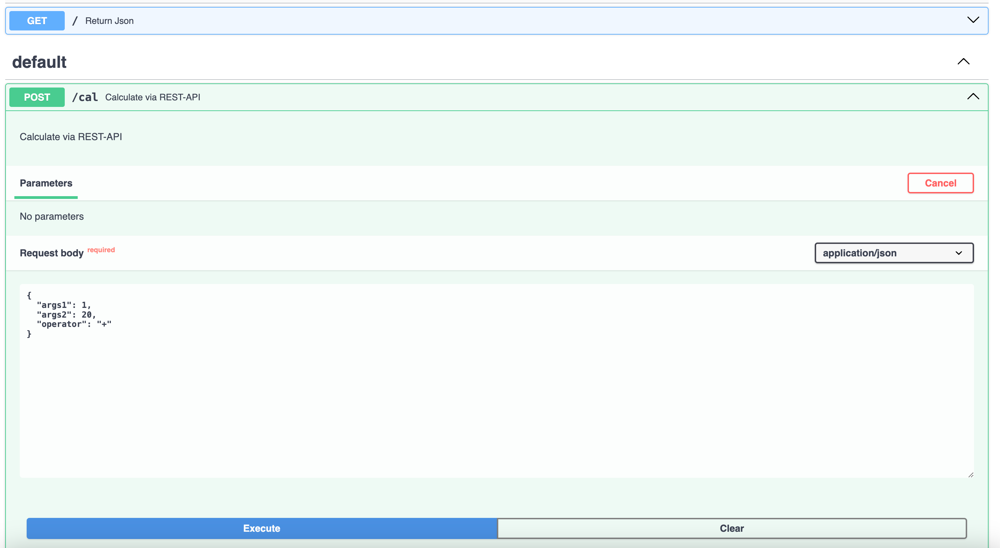

## Two ways build a Calculator
- PHP UI based using Form/Post based on Cal Class (<i>http://localhost:3000/php-python-cal/php-ui/main.php</i>)
- PHP UI based using jquery based on REST API built FASTAPI (<i>http://localhost:7777/docs</i>)
- Install Poerty
```
https://python-poetry.org/docs/?ref=dylancastillo.co#installing-with-the-official-installer
```

Using Python Virtual Environment
```bash
python -m venv .venv
source .venv/bin/activate
```

Using Poetry: Create the virtual environment in the same directory as the project and install the dependencies:
```bash
poetry config virtualenvs.in-project true
poetry init
poetry add fastapi
poetry add uvicorn
poetry add pytz
```

Jquery UI <----> REST API
```bash
UI : http://localhost:3000/php-python-cal/php-restapi/main.html
API : http://localhost:7777/docs#/default/calculate_cal_post
```


Pytest
```bash
.venv) (base) ➜  php-restapi git:(master) ✗ pytest -v tests 
=========================================================== test session starts ============================================================
platform darwin -- Python 3.9.7, pytest-7.0.1, pluggy-0.13.1 -- /Users/euiyoung.hwang/opt/anaconda3/bin/python
cachedir: .pytest_cache
rootdir: /Users/euiyoung.hwang/ES/Python_Workspace/php-python-cal/php-restapi
plugins: anyio-3.6.1, mock-3.6.1, cov-4.0.0
collected 8 items                                                                                                                          

tests/test_cal.py::test_cal[1-1-+-2] PASSED                                                                                          [ 12%]
tests/test_cal.py::test_cal[1-1---0] PASSED                                                                                          [ 25%]
tests/test_cal.py::test_cal[1-1-*-1] PASSED                                                                                          [ 37%]
tests/test_cal.py::test_cal[1-1-/-1] PASSED                                                                                          [ 50%]
tests/test_cal.py::test_cal[2-2-+-4] PASSED                                                                                          [ 62%]
tests/test_cal.py::test_cal[2-2---0] PASSED                                                                                          [ 75%]
tests/test_cal.py::test_cal[2-2-*-4] PASSED                                                                                          [ 87%]
tests/test_cal.py::test_cal[2-2-/-1] PASSED            
```